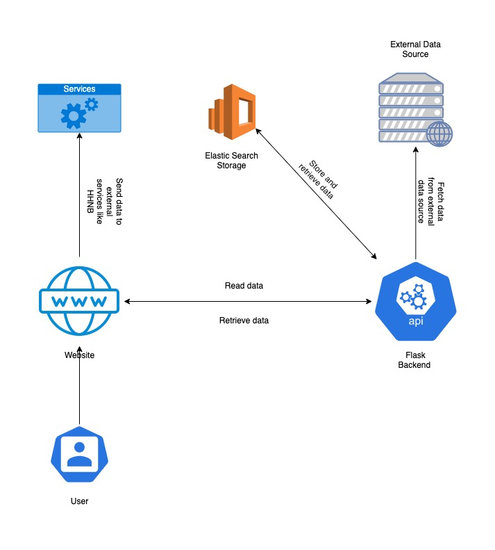

#HBP FRONTEND

#INTRO

"HBP FRONTEND" is a project developed using Nest.js for accomplish the goal to show data retrieved from HBP BACKEND (https://github.com/hippocampushub/hbp-backend-python).

##SETUP
A few steps are needed for start the projects in development mode:
1. Run `npm install`
2. Run `npm run start` : after this command a development web server is runned on `http://localhost:3000`

##BUILD AND DEPLOY
For building the project a few steps are required based on where you want to deploy the project.
If you want to deploy on github:
1. Run `npm run publish` from the root folder of the project, it will automatically run `next build` and then commit and push the content inside the gh-pages of your branch.

If you want to deploy on a classic web server:
1. Run `npm run build`, it will automatically run next build and next export. The output will be stored in the build folder under the root of the project.
2. Upload the content of the build directory on you web server. 

##NEXT CONFIG

The next.config.js file includes a few params for config the web application.

- The basePath param define the path on which web application must be deployed. For example /community is the actual hippocampus hub path.

- The assetPrefix param define the base path on which web application search for public assets (images for example)

- The env variable needs to define all environment variable used on build time 
    - The env BASE_URL is equal to basePath for use in build
    - The env BACKEND_URL define the backend base url for api call (the url in which hbp-backend is deployed)
    - The env HODGKIN_HUXLEY_BASE_URL define the url for run Hodgkin-Huxley Neuron Builder
  
##STATE MANAGEMENT
For the state management Redux is used. It help for keep the state of the app and have a unique source of truth for manage a few behaviours of the webapp.

##ARCHITECTURE
The architecture reflect the follow diagram.
The website only call the Flask Backend API for retrieve data and send data to external services like HHNB.

##PROJECT STRUCTURE
The projects follow a simple structure based on React and Redux components separation.
1. Actions: this folder contains a few redux actions
2. Components: this is the main UI folder. It contains the definitions of all the UI componenents used in the web app.
3. Constants: this folder contains the definitions of the constants for Redux actions and other global constants.
4. Helpers: this folder contains helpers for most of the business logic of the app.
5. Pages: this is the ordinary pages folder of a Nest.js app. It is used for define UI for all the pages of the app.
6. Public: this folder is used for store static files.
7. Reducers: this folder contains the definition of the Redux reducers.
8. Style: this folder contains style definition for the app.

###PUBLIC FOLDER
The public folder is very important in the project because it contains json configuration files that define the main navigation and pages structure.
The json_data folder inside it contains all configuration files and `static data` for show inside page.

####CONFIG FILE
The config.json file contains global configuration used on all the website.
It contains options for populate the header and footer sections and for TOS (terms of service) overlay.

####HOME PAGE FILE
The home-page.json file contains configuration for home page contents.
It contains a `headerCarousel`property that define the full width image to show on header.
It also contains a `columnBlocks` property that define the content of the blocks showed on the home page.

####MENU ITEMS FILE
The menu-items.json file contains the configuration for the navigation menu.
It allows to define menu item content and link.
The link can be a path or a URL.
It also allows to define sub menu items using nested menuitems attribute on menu item.

###PAGES FILE
The pages json files contains the configuration for show static content on website pages.
The content is retrieved using the getPage helper method defined in helpers/dataHelper.ts file.
The standard content json contains an object with this format:
`{
  "id": number,
  "title": string,
  "description": string,
  "content": string, //main content on section
  "variant": "dark"|"light",
  "slug": string,
  "sections": [
    "id": string,
    "header": string,
    "variant": "dark"|"light",
    "rows": [{
       "header": string,
       "columns": [{
            "content": string
       }]
    }]
  }]
}`

